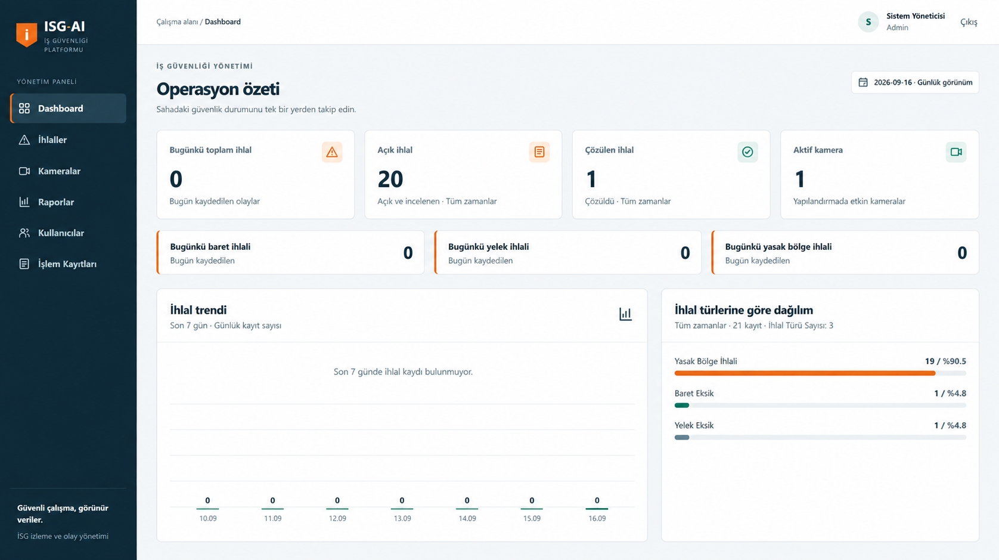
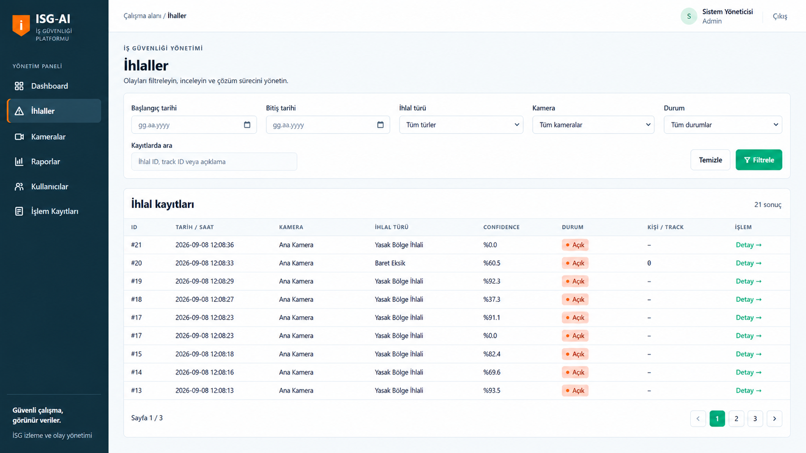
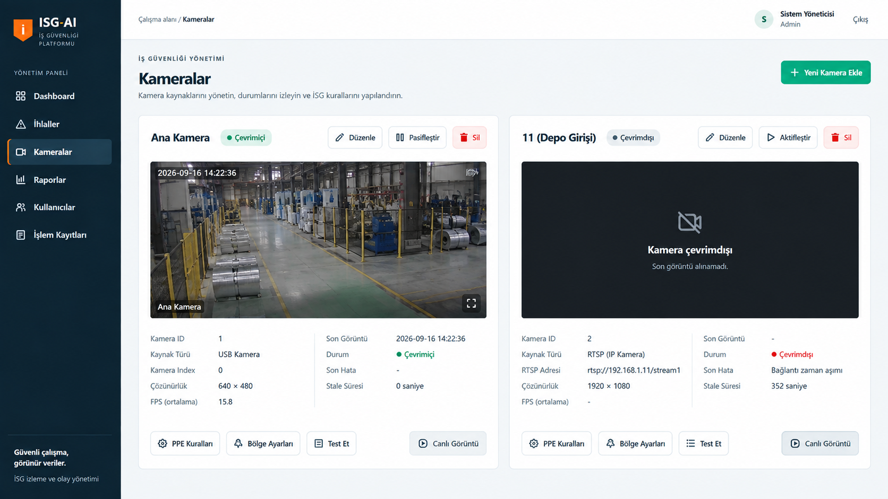
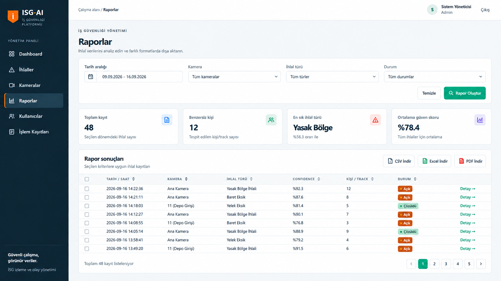
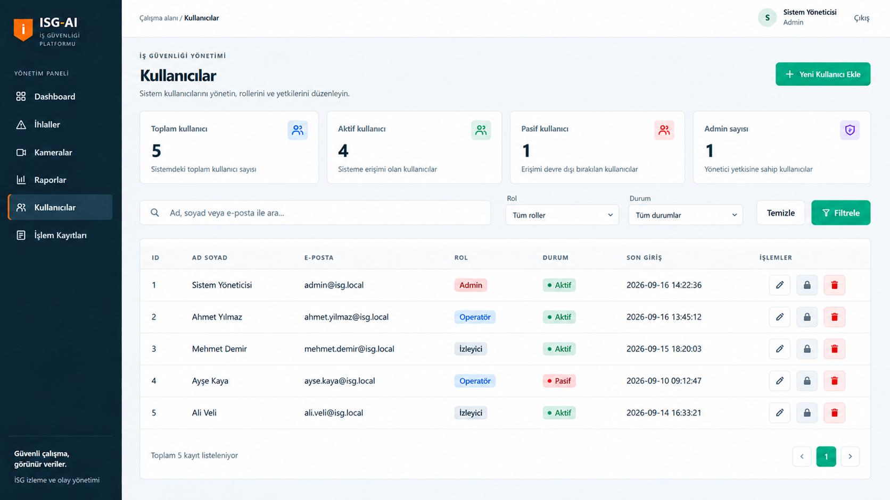

\# 🦺 AI-Powered Workplace Safety Monitoring System


An AI-powered workplace safety monitoring and management system designed for real-world industrial environments.


The project combines \*\*Computer Vision, Artificial Intelligence, Web Development, Database Management, and Security\*\* to detect workplace safety violations, monitor cameras, manage safety rules, and provide a centralized web dashboard.


Built with \*\*Python, YOLO, OpenCV, Flask, and SQLite\*\*.


\---


\## 🎯 Project Overview


The system analyzes camera feeds using computer vision models and helps identify potential workplace safety violations.


It was designed with industrial environments in mind, where multiple cameras, configurable safety rules, PPE requirements, reporting, and system health monitoring need to work together.


The project goes beyond basic object detection by combining AI inference with a complete management platform.


\---


\## ✨ Key Features


\### 🤖 AI \& Computer Vision


\- Real-time person detection

\- YOLO-based object detection

\- Pose-based analysis

\- PPE detection and validation

\- Helmet / no-helmet detection

\- Safety vest / no-safety-vest detection

\- Configurable confidence thresholds

\- Multi-frame violation validation

\- Person tracking and association

\- Duplicate violation suppression


\### 🦺 PPE Safety Rules


PPE requirements can be configured on a per-camera basis.


Currently supported detection rules include:


\- Safety helmet

\- Safety vest


PPE rules can be updated dynamically without restarting the running service.


\---


\## 📹 Camera Management


The system includes a camera management architecture designed for multiple video sources.


Features include:


\- USB camera support

\- Architecture for IP / RTSP camera sources

\- Multiple camera configuration

\- Per-camera safety rules

\- Camera activation / deactivation

\- Unique camera configuration

\- Dynamic camera configuration architecture


\---


\## ❤️ Camera Health Monitoring


Each camera can be monitored independently.


The system tracks information such as:


\- Online / Offline / Unknown status

\- Last received frame

\- Last error

\- Safe error codes

\- FPS information

\- Camera health timestamps


This allows the management panel to detect cameras that are unavailable or no longer producing frames.


\---


\## 🚨 Violation Management


Detected safety violations can be stored and managed through the application.


Features include:


\- Violation type

\- Camera information

\- Person / tracking information

\- Detection confidence

\- Timestamp

\- Resolution status

\- Resolution notes

\- Search and filtering

\- Pagination

\- Detailed violation view


A suppression mechanism helps prevent the same tracked violation from being recorded repeatedly within a short period.


\---


\## 🖥️ Web Management Panel


A Flask-based administration panel provides centralized access to the system.


Main modules include:


\- Dashboard

\- Violations

\- Cameras

\- PPE Rules

\- Users

\- Permissions

\- Reports


The dashboard provides an overview of system activity, including:


\- Violation statistics

\- Recent violations

\- Violation type distribution

\- 7-day trends

\- Camera summaries

\- Camera health information


\---


\## 📊 Reporting


The system supports filtered report generation and export.


Supported formats include:


\- CSV

\- Excel

\- PDF


Reports can be generated based on selected filters and safety violation records.


CSV export includes protection against spreadsheet formula injection.


\---


\## 🔐 Security


Security was considered as part of the application architecture rather than added only at the interface level.


Implemented features include:


\- Authentication

\- Login / logout system

\- Role-based access controls

\- Administrator protections

\- Protection against removing the last active administrator

\- Password policy

\- CSRF protection

\- Login rate limiting

\- Security-related HTTP headers

\- Audit logging

\- Secure error handling


Sensitive credentials and production data are intentionally excluded from this public repository.


\---


\## 🗄️ Database


The application uses SQLite for local application data.


The database architecture includes data related to:


\- Violations

\- Users

\- Login attempts

\- Cameras

\- Camera health

\- PPE rules

\- Audit records


Database migrations were designed to preserve existing data while extending the application with new functionality.


\---


\## ⚙️ Runtime Architecture


The runtime architecture separates responsibilities across multiple components.


Key concepts include:


\- Camera capture

\- AI inference

\- PPE detection

\- Pose processing

\- Person / PPE association

\- Safety rule evaluation

\- Violation persistence

\- Camera health reporting

\- Runtime configuration

\- Web administration


For multi-camera operation, the architecture is designed around independent camera capture with centralized inference scheduling.


\---


\## 🧠 Violation Validation


To reduce false positives, PPE violations are not generated from a single negative detection.


The system uses multi-frame validation before confirming a violation.


Tracking and suppression logic also help prevent repeated records for the same person and violation within a short time window.


\---


\## 🧪 Testing


The project includes automated regression tests covering important application functionality.


Testing has been used throughout development to validate areas such as:


\- PPE rules

\- Camera health

\- Runtime configuration

\- Database behavior

\- Security

\- Violation handling

\- Web application functionality


The system has also been tested using a real USB camera.


\---


\## 🛠️ Tech Stack


\### Languages


\- Python

\- HTML

\- CSS

\- JavaScript

\- SQL


\### Backend


\- Flask


\### AI \& Computer Vision


\- YOLO

\- OpenCV


\### Database


\- SQLite


\### Development \& Tools


\- Git

\- GitHub

\- Docker

\- Visual Studio Code


\---


\## 📁 Project Structure


```text

isg-ai-public/

│

├── ai\_service/          # AI inference and safety processing

├── scripts/             # Utility and maintenance scripts

├── tests/               # Automated tests

├── web\_app/             # Flask management application

│

├── camera\_health.py     # Camera health monitoring

├── isg\_database.py      # Database operations

├── isg\_security.py      # Security utilities

├── requirements.txt     # Python dependencies

├── .gitignore

└── README.md

```


\---

## 🖥️ Interface Preview

The system includes a web-based management panel for monitoring workplace safety operations, reviewing violations, managing cameras, generating reports, and controlling user access.

### Dashboard

Provides a centralized overview of safety operations, including violation statistics, camera status, recent events, and violation trends.



### Violation Management

Safety violations detected by the system can be reviewed, searched, filtered, and managed through the violations interface.



### Camera Management

Camera sources can be monitored and configured individually. The interface provides camera health information, source status, PPE rules, and safety-zone configuration.



### Reporting

Violation records can be filtered and exported for further analysis and documentation.



### User Management

Administrators can manage system users, roles, account status, and access permissions from the management panel.



\## 🚀 Installation


Clone the repository:


```bash

git clone https://github.com/alperen-dag/isg-ai-public.git
cd isg-ai-public

```


Create a virtual environment:


```bash

python -m venv venv

```


Activate it on Windows:


```bash

venv\\Scripts\\activate

```


Install dependencies:


```bash

pip install -r requirements.txt

```


> This repository is a public portfolio version of the project. Production databases, credentials, model files, camera credentials, runtime-generated data, and other sensitive assets are intentionally excluded.


\---


\## 🔒 Public Repository Notice


This repository contains a sanitized portfolio version of the system.


The public version intentionally excludes:


\- Production databases

\- Camera credentials

\- Environment secrets

\- Runtime-generated violation data

\- Backups

\- Private configuration

\- AI model weight files

\- Organization-specific information


Example values used in tests are not production credentials.


\---


\## 🗺️ Future Development


Potential future improvements include:


\- Extended PPE detection

\- Production RTSP camera deployment

\- Additional safety violation types

\- Improved tracking

\- Notification integrations

\- Advanced analytics

\- Containerized deployment

\- Additional AI model support


\---


\## 👨‍💻 Developer


\*\*Alperen Dağ\*\*


Web Developer | Python \& AI Automation


I build practical, business-focused software solutions combining web development, automation, databases, and artificial intelligence.


🌐 Website: https://rivashe.com


\---


\## 📌 Project Status


\*\*Active Development / Portfolio Project\*\*


The system was originally developed and tested around a real industrial workplace safety use case and is being maintained as a portfolio demonstration of applied AI, computer vision, backend development, database design, and application security.

